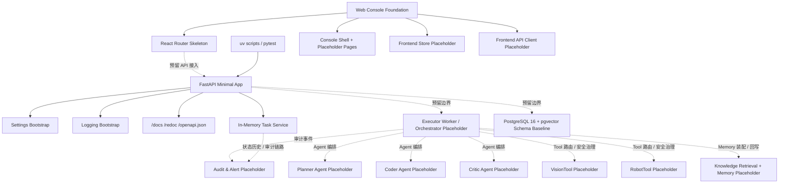

# 当前系统架构真相文档

## 1. 当前定位

本文件描述当前版本系统的真实架构边界，而不是未来愿景。

当前代码阶段：

- 已具备单仓库基础目录骨架
- 已完成步骤 03：后端工程基础初始化
- 已完成步骤 04：前端工程基础初始化
- 已完成步骤 05：共享领域模型与任务状态机
- 已完成步骤 06：数据库结构与迁移基线
- 已完成步骤 07：审计与告警数据模型
- 已完成步骤 08：配置管理与安全默认值
- 已完成步骤 09：鉴权和角色权限模型的代码实现与本地验证
- 已完成步骤 10：后端基础 API 框架的代码实现、本地验证与用户验收
- 已完成步骤 11：任务创建、列表、详情与执行链路查询接口的代码实现、本地验证与用户验收
- 后端当前可完成一致安装、配置校验、最小启动与数据库迁移 SQL 生成
- 前端当前可完成依赖安装、构建和本地启动
- 步骤 07 已通过用户验收
- 步骤 08 已通过用户验收
- 步骤 09 已通过用户验收
- 步骤 10 已通过用户验收
- 步骤 11 已通过用户验收

当前阶段默认不做：

- 真实机械臂接入
- 真实视觉硬件接入
- 本地 Ollama 部署
- 多工位、多机器人、多品牌、多模型支持

当前尚未实现：

- 真实业务 API 接口已开始落地，当前已实现任务创建、任务列表、任务详情与执行链路查询；其余业务接口仍待后续步骤实现
- Executor Worker / Orchestrator 执行流程
- Planner / Coder / Critic Agent 运行时
- Tool Layer（VisionTool / RobotTool）
- Memory Layer（Knowledge Retrieval / Short-Term Memory / Long-Term Memory）
- Audit & Alert 写入服务与业务接口
- 前后端真实数据联调
- 模拟闭环与端到端执行链路

## 2. 当前已落地结构

## 3. 当前代码级模块现状

### 3.1 仓库骨架

- 当前仓库目录已包含：`backend/`、`frontend/`、`docs/`、`infrastructure/`、`tests/`、`memory-bank/`
- 当前 `backend/` 与 `frontend/` 均已完成基础工程骨架

### 3.2 Backend 工程基础

- 使用 `uv` 管理 Python 项目
- 通过 `.python-version` 固定 `Python 3.11`
- 通过 `pyproject.toml` 管理运行依赖与开发依赖
- 通过提交 `uv.lock` 保证依赖安装一致性
- 当前代码包根目录为 `backend/src/robot_control_backend/`
- 已建立最小 FastAPI app factory、Uvicorn 启动入口、配置加载入口和日志初始化入口
- 已提供示例环境文件和最小 smoke tests
- 已新增 `auth/` 模块，提供角色定义、权限矩阵、服务端 Session 和 Cookie 鉴权能力
- 已新增 `task_service/` 模块，提供 Step 11 进程内任务聚合、状态历史和审计链路能力
- 已建立 `robot_control_backend.database` ORM 元数据包
- 已建立 `alembic/` 迁移脚手架和首个迁移版本

### 3.3 API Server

- 已实现最小 FastAPI 应用启动能力
- 当前已提供框架级能力：
  - OpenAPI 文档输出
  - 统一 API 分组标签
  - 统一成功/错误响应 envelope
  - 统一错误码与预留分页元信息
  - 请求级 `X-Request-ID` / `X-API-Version`
  - 应用生命周期启动与关闭日志
  - 统一异常处理
  - 配置校验失败时快速退出
- 当前已实现：
  - `POST /api/auth/login`
  - `POST /api/auth/logout`
  - `GET /api/auth/me`
  - `GET /api/auth/permission-matrix`
  - `POST /api/tasks`
  - `GET /api/tasks`
  - `GET /api/tasks/{task_id}`
  - `GET /api/tasks/{task_id}/execution-chain`
  - `GET /api/tasks/_access-check`
  - `GET /api/plans/_access-check`
  - `GET /api/alerts/_access-check`
  - `POST /api/alerts/_handle-check`
  - `POST /api/config/robot/_access-check`
  - `POST /api/config/safety-rules/_access-check`
  - `POST /api/knowledge/items/_access-check`
  - `POST /api/knowledge/samples/_access-check`
  - `GET /api/audit/_access-check`
  - `GET /api/system/health`
  - `GET /api/system/version`
- 当前所有 API 响应已统一为 `success + data/error + meta` 结构，并保留分页元数据位
- 当前鉴权实现采用引导账号 + API 进程内 Session 存储，用于先锁定认证契约和权限边界
- 当前任务业务接口由应用内 `InMemoryTaskService` 支撑，负责输入完整性校验、最小执行条件校验、状态历史记录与任务审计链路聚合
- 当前尚未实现告警、审计、知识库和配置业务 CRUD 接口，也尚未将任务聚合持久化到数据库

### 3.4 Frontend 工程基础

- 使用 `Node.js + React 19 + TypeScript + Vite 8 + Ant Design`
- 已生成 `package-lock.json`，固定当前依赖解析结果
- 当前代码根目录为 `frontend/src/`
- 已建立应用入口、主题配置、全局样式和 Vite 配置
- 已建立前端环境变量约定，当前保留 `VITE_API_BASE_URL` 作为后续后端接入入口

### 3.5 Web Console

- 已实现控制台应用壳和基础导航框架
- 已建立页面目录边界，当前页面均为占位页，不包含业务逻辑
- 当前已预留以下路由：
  - `/login`
  - `/tasks`
  - `/tasks/new`
  - `/tasks/:taskId`
  - `/alerts`
  - `/audit`
  - `/knowledge/items`
  - `/knowledge/samples`
  - `/config/robot`
  - `/config/safety-rules`
- 当前已建立 API 目录和状态管理目录，但仍属于占位骨架

当前设计口径下，系统运行时按以下层次理解：

- 编排层：`Executor Worker / Orchestrator` 负责任务生命周期、状态流转、重试控制、上下文装配、Tool 路由与安全治理，但不替 Agent 决定调用哪个 Tool。
- Agent 层：`Planner Agent`、`Coder Agent`、`Critic Agent` 是三个核心智能角色。
- Tool 层：`VisionTool` 与 `RobotTool` 为 Agent loop 提供感知、执行与复检能力，Tool 选择由 Agent 决策。
- Memory 层：知识检索、短期记忆和长期记忆共同构成 Agent 的上下文与经验系统。
- 审计层：审计与告警横切上述各层，记录关键输入、输出和状态变化。

### 3.6 Executor Worker / Orchestrator

- 当前仅保留包边界，占位未实现
- 当前定义为执行编排器，而不是 Planner / Coder / Critic 的智能决策主体
- 尚未接入任务轮询、状态流转，以及对 Agent 层、Tool 层、Memory 层的串行驱动、Tool 调用路由与上下文装配

### 3.7 Planner Agent

- 当前仅保留逻辑边界，占位未实现
- 后续负责从任务输入和 Memory Layer 上下文中生成受控动作步骤，并按需发起 VisionTool 调用请求

### 3.8 Coder Agent

- 当前仅保留逻辑边界，占位未实现
- 后续负责把 Planner Agent 的受控步骤结合 SDK 约束、模板和示教知识映射为受控脚本摘要与模板绑定

### 3.9 Critic Agent

- 当前仅保留逻辑边界，占位未实现
- 后续负责结合工具返回事实与规则约束，对 Planner Agent 和 Coder Agent 的产物进行规则校验与轨迹检查，并在必要时发起补充 Tool 调用请求

### 3.10 VisionTool Adapter

- 当前仅保留 Tool 层逻辑边界，占位未实现
- 尚未实现响应 Agent 决策、经 Orchestrator 路由后向 Agent 层提供结构化观察结果的模拟视觉适配器

### 3.11 RobotTool Adapter

- 当前仅保留 Tool 层逻辑边界，占位未实现
- 尚未实现接收经 Critic 放行并由 Orchestrator 路由的模拟机械臂执行适配器

### 3.12 Knowledge Retrieval & Memory Runtime

- 当前仅保留 Memory 层逻辑边界，占位未实现
- 尚未实现知识检索、短期记忆装配与长期记忆回写服务

### 3.13 Audit & Alert

- 已落地共享枚举、领域模型、ORM 模型和 Step 07 审计/告警写入规则
- 已支持告警通过 `related_audit_event_id` 关联主审计事件，并对 raw chain-of-thought 载荷做拦截约束
- 尚未实现审计写入服务、告警聚合处理、业务查询接口和端到端链路接入

## 4. 当前后端启动、配置与日志约定

- 包管理工具：`uv`
- Python 版本约束：`3.11`
- 依赖安装命令：`uv sync` / `uv sync --group dev`
- 配置校验命令：`uv run robot-control-config-check`
- 应用启动命令：`uv run robot-control-api`
- 环境变量统一使用 `RCA_` 前缀
- `RCA_APP_ENV` 当前支持：
  - `development`
  - `test`
  - `production`
- 配置加载优先级：
  - 进程环境变量
  - `.env.<environment>`
  - `.env`
  - 代码默认值
- 当前统一配置模块已覆盖：
  - 数据库
  - 共享模型 provider
  - 视觉适配器
  - 机器人适配器
  - 鉴权会话默认值
  - 审计保留策略
  - 安全规则默认值
  - 工件存储
- 生产环境当前强制要求：
  - `RCA_DATABASE_URL`
  - `RCA_SHARED_MODEL_API_KEY`
- 真实执行链路当前强制要求：
  - `RCA_EXECUTION_ALLOW_REAL_HARDWARE=true`
  - `RCA_EXECUTION_ROBOT_CONFIG_ID`
  - `RCA_SAFETY_RULE_SET_ID`
  - `RCA_DATABASE_URL`
  - `RCA_SHARED_MODEL_API_KEY`
  - `RCA_SAFETY_EMERGENCY_STOP_ENABLED=true`
- 附加真实适配器要求：
  - `RCA_ROBOT_CONTROL_ENDPOINT` 在 `RCA_ROBOT_ADAPTER_MODE=real` 时必填
  - `RCA_VISION_CALIBRATION_FILE` 在 `RCA_VISION_ADAPTER_MODE=real` 时必填且必须存在
- 默认保持视觉与机器人适配器处于 `simulated` 模式
- `RCA_AUDIT_STORE_RAW_REASONING` 必须保持为 `false`
- 当前鉴权相关配置还包括：
  - `RCA_AUTH_ADMIN_USERNAME`
  - `RCA_AUTH_ADMIN_PASSWORD`
  - `RCA_AUTH_OPERATOR_USERNAME`
  - `RCA_AUTH_OPERATOR_PASSWORD`
- 默认日志格式为 JSON stdout
- 本地调试可切换为 `RCA_LOG_FORMAT=console`
- `robot-control-config-check` 当前会输出安全摘要，并在启用 `RCA_DATABASE_CONNECTIVITY_CHECK=true` 时执行数据库连通性预检
- 工件目录会在启动时校验可写性，并在 `RCA_ARTIFACT_AUTO_CREATE=true` 时自动创建
- 当前 Session 后端为 API 进程内内存实现，Cookie 策略由 `RCA_AUTH_SESSION_COOKIE_NAME`、`RCA_AUTH_SESSION_TTL_MINUTES`、`RCA_AUTH_REQUIRE_SECURE_COOKIES` 和 `RCA_AUTH_COOKIE_SAME_SITE` 控制
- 配置缺失或非法时，进程会快速失败并输出可读错误信息

## 5. 当前前端启动与目录约定

- 包管理工具：`npm`
- Node 版本要求：`>=22.0.0`
- 依赖安装命令：`npm.cmd install`
- 本地启动命令：`npm.cmd run dev`
- 构建验证命令：`npm.cmd run build`
- 前端环境变量统一使用 `VITE_` 前缀
- 当前目录边界已锁定为：
  - `src/app`
  - `src/routes`
  - `src/pages`
  - `src/components`
  - `src/api`
  - `src/stores`
  - `src/styles`
- 当前命名规则已锁定：
  - 路由路径使用 `kebab-case`
  - 页面文件使用 `kebab-case` + `.page.tsx`
  - 状态管理文件使用 `kebab-case` + `.store.tsx`
  - API 模块使用 `kebab-case` + `.api.ts`

## 6. 当前验证结果

后端验证结果：

- `uv lock` 已成功生成并固定锁文件
- `uv sync --group dev` 已通过
- `uv run pytest` 已通过
- `uv run pytest tests -q` 已通过，当前共 34 项测试
- `uv run robot-control-config-check` 在开发环境下可通过
- 生产环境缺少关键配置时会直接报错
- 真实执行链路在缺少放行开关、机器人配置、安全规则、模型密钥或适配器必需参数时会被配置层直接拦截
- 数据库连通性预检可在启用后返回清晰错误信息
- 未登录访问受保护接口会返回结构化 `401`
- 操作员访问管理员专属配置、知识库和审计接口会返回结构化 `403`
- 未知 API 路径与请求校验错误会分别返回结构化 `404` / `422`
- 管理员可访问全量配置、告警处理和审计权限校验端点
- 操作员可创建任务、查看任务列表/详情，并查询任务执行链路
- 任务创建会在输入完整性校验通过后继续检查工位上下文、活动机器人配置、安全规则集和急停开关
- 新创建任务会生成唯一任务标识，并同步写入状态历史和任务审计链路
- 最小服务启动后，`/openapi.json` 返回 `200`
- `GET /api/system/health` 与 `GET /api/system/version` 返回 `200`
- API 响应头会稳定返回 `X-Request-ID` 与 `X-API-Version`
- `uv run alembic upgrade head --sql` 已通过，可离线生成 Step 06 / Step 07 迁移 SQL
- 当前尚未对真实 PostgreSQL 空库执行在线迁移

前端验证结果：

- `npm.cmd install` 已通过
- `npm.cmd run build` 已通过
- `npm.cmd run dev` 可正常启动
- `/` 路由返回 `200`
- `/tasks/new` 路由返回 `200`

## 7. 当前状态机现状

当前状态机已在代码中落地，定义位于 `backend/src/robot_control_backend/domain/state_machine.py`，并由测试覆盖主流程、失败流程和非法跳转拦截。

已锁定的目标状态包括：

- `created`
- `planning`
- `validating`
- `ready_to_run`
- `running`
- `verifying`
- `succeeded`
- `failed`
- `emergency_stopped`

当前状态流转原则仍保持不变：

- 单工位同一时刻只允许一个任务进入执行链路
- Planner Agent / Coder Agent / Critic Agent 阶段允许最多 3 次内部循环尝试
- 任务级状态机在 `validating -> planning` 上表达一次内部回退；更细粒度的 `Planner Agent / Coder Agent` 回退分流将在后续执行编排实现中落地
- 达到最大尝试次数后，Planner Agent 输出用户可读失败结论，任务进入 `failed`
- 任何危险目标检测或紧急停机都直接进入 `emergency_stopped`

## 8. 当前数据库现状

- 数据库技术选型已锁定为 `PostgreSQL 16 + pgvector`
- 当前已完成 Step 06 ORM 元数据、Alembic 脚手架与初始迁移，以及 Step 07 审计/告警模型增量迁移
- 当前 Alembic 会按 `RCA_DATABASE_URL -> .env.<environment> -> .env` 解析数据库地址
- 当前代码尚未接入数据库会话工厂、Repository 或服务层持久化逻辑
- 当前 API Server 仍未真正读写数据库，数据库基线目前只服务于后续步骤实现和迁移演进

当前已落地的核心表包括：

- `users`
- `roles`
- `user_roles`
- `sessions`
- `artifact_references`
- `robot_configs`
- `safety_rule_sets`
- `system_configs`
- `tasks`
- `semantic_action_plans`
- `execution_plans`
- `execution_results`
- `alerts`
- `audit_records`
- `knowledge_items`
- `teaching_samples`
- `long_term_memories`

当前已落地的数据库基线能力还包括：

- `knowledge_items.embedding`、`teaching_samples.embedding`、`long_term_memories.embedding` 三个 `pgvector` 字段
- 三类 `retrieval_metadata` JSONB 元数据过滤字段及 GIN 索引
- 任务状态、机器人标识、告警处理状态、审计检索字段等关键索引
- `alerts.related_audit_event_id -> audit_records.audit_event_id` 告警到主审计事件关联
- `audit_event_type_enum` 已补充 `context_assembled`、`tool_called`、`agent_output_recorded`
- `20260416_01` 初始迁移版本
- `20260420_01` Step 07 审计与告警模型增量迁移
- `backend/tests/test_database_schema.py` 对核心表、关键约束、索引和向量字段做了基线校验

## 9. 当前接口现状

当前已存在的后端框架级接口能力：

- `/docs`
- `/redoc`
- `/openapi.json`
- 所有 JSON 接口统一返回 `success/data/meta` 或 `success/error/meta`
- 所有 API 响应头统一返回 `X-Request-ID` 与 `X-API-Version`
- `/api/auth/login`
- `/api/auth/logout`
- `/api/auth/me`
- `/api/auth/permission-matrix`
- `/api/tasks`
- `/api/tasks/{task_id}`
- `/api/tasks/{task_id}/execution-chain`
- `/api/tasks/_access-check`
- `/api/plans/_access-check`
- `/api/alerts/_access-check`
- `/api/alerts/_handle-check`
- `/api/config/robot/_access-check`
- `/api/config/safety-rules/_access-check`
- `/api/knowledge/items/_access-check`
- `/api/knowledge/samples/_access-check`
- `/api/audit/_access-check`
- `/api/system/health`
- `/api/system/version`

当前已存在的前端框架级页面路由能力：

- `/login`
- `/tasks`
- `/tasks/new`
- `/tasks/:taskId`
- `/alerts`
- `/audit`
- `/knowledge/items`
- `/knowledge/samples`
- `/config/robot`
- `/config/safety-rules`

除已实现的认证接口、系统框架接口和任务接口外，已锁定但尚未实现的业务接口分组包括：

- 计划与脚本摘要接口
- 告警接口
- 审计接口
- 知识条目接口
- 示教样本接口
- 长期记忆查询接口
- 机械臂配置接口
- 安全规则接口

## 10. 关键运行规则

- Windows 为唯一目标宿主机
- 当前实现必须默认跳过真实硬件联调步骤
- 危险目标只要检测到就全局停机
- 安全规则由管理员在控制台录入
- 默认成功判定阈值：
  - 放置位置容差 5 mm
  - 视觉复检阈值 0.7
  - 单次任务最大允许时长 60 s

## 11. 后续更新规则

以下情况必须更新本文件：

- 后端基础约定发生变化
- 前端基础约定发生变化
- 模块边界发生变化
- 状态机发生变化
- 数据库主模型发生变化
- 接口分组发生变化
- 模拟适配器切换为真实硬件适配器
- 模型提供方策略发生变化
